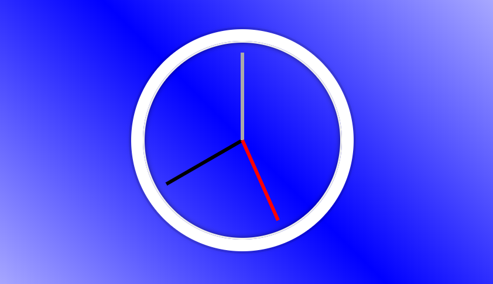

###javascript30.com_challenge_javascript_clock

*Hour hand
*Minute hand
*Seconds hand

Use of transform and Date Object to move hour, minute and seconds hands by means of *Javascript*
https://javascript30.com

